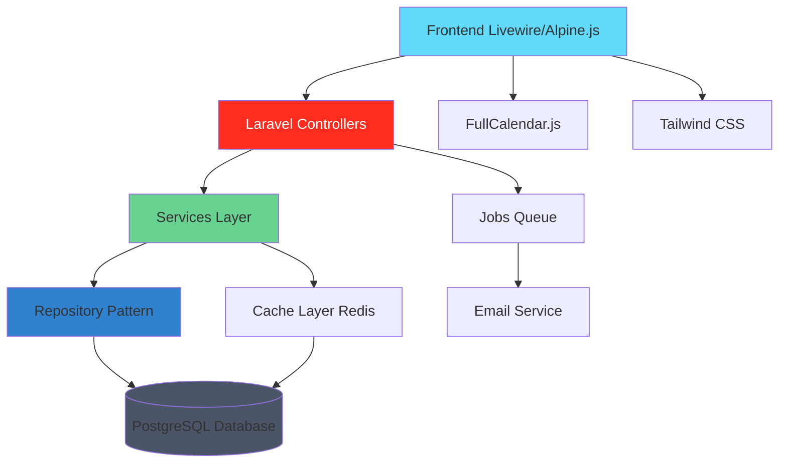

# 🏗️ VG General Contractors - Appointment Management System

[](https://laravel.com/)
[](https://php.net/)
[](https://postgresql.org/)
[](https://tailwindcss.com/)
[](https://laravel-livewire.com/)
[](https://opensource.org/licenses/MIT)

A complete web platform to automate the lifecycle management of property inspections. Manage leads, appointments, interactive calendars, and automated communication in a modern and responsive interface.

## 📋 Table of Contents

-   [✨ Features](#-features)
-   [🚀 Demo](#-demo)
-   [🏗️ Architecture](#️-architecture)
-   [🛠️ Technologies](#️-technologies)
-   [📁 Project Structure](#-project-structure)
-   [⚡ Quick Start](#-quick-start)
-   [📖 API Documentation](#-api-documentation)
-   [🧪 Testing](#-testing)
-   [🚀 Deployment](#-deployment)
-   [🤝 Contributing](#-contributing)
-   [📝 License](#-license)
-   [👥 Authors](#-authors)

## ✨ Features

### 🎯 Complete Appointment Management

-   **Interactive Calendar**: Visual scheduling with drag-and-drop using FullCalendar.js
-   **Conflict Validation**: Intelligent system to prevent appointment overlaps
-   **Appointment Status Tracking**: Complete tracking from lead to completion (Pending, Confirmed, Completed, Rejected)
-   **Responsive Design**: Optimized for desktop, tablet, and mobile

### 🔧 Lead Management and Conversion

-   **Multi-Source Lead Capture**: Integration with website, Facebook Ads, referrals, and Retell AI
-   **Status Tracking**: Lead → Contacted → Pending → Rejected/Confirmed
-   **Automatic Conversion**: Automatic transformation of qualified leads into confirmed appointments
-   **Administrative Dashboard**: Complete panel with metrics and CRUD management

### 📧 Automated Communication

-   **Automated Emails**: Confirmations, rescheduling, and rejections with customized templates
-   **Real-Time Notifications**: Alert system and instant updates
-   **Service Integration**: Support for multiple communication channels
-   **Queued Jobs**: Asynchronous processing for maximum performance

## 🚀 Demo

### Screenshots

#### Dashboard Administrativo


#### Calendario Interactivo


#### Gestión de Citas


> 📸 _Screenshots will be updated with real project captures_

### Development URLs

-   **Main Application**: http://localhost:8000
-   **API Base**: http://localhost:8000/api
-   **Admin Panel**: http://localhost:8000/admin
-   **Calendar**: http://localhost:8000/admin/appointment-calendar

## 🏗️ Architecture



### System Architecture

```
VGENERALCONTRACTORS-WEB/
├── app/                              # 🖥️  Core Application
│   ├── Http/Controllers/            # 🎮 MVC Controllers
│   │   ├── Api/                     # 🔌 API Endpoints
│   │   ├── Admin/                   # 👑 Administrative Panel
│   │   ├── AppointmentController.php
│   │   ├── AppointmentCalendarController.php
│   │   └── BaseCrudController.php   # 🏗️  Base CRUD Controller
│   ├── Models/                      # 📊 Eloquent Models
│   ├── Services/                    # 🔧 Business Logic
│   ├── Jobs/                        # ⚡ Queued Jobs
│   ├── Mail/                        # 📧 Email Templates
│   └── Traits/                      # 🧬 Reusable Traits
├── database/                        # 🗄️  Database
│   ├── migrations/                  # 📝 Migrations
│   ├── seeders/                     # 🌱 Initial Data
│   └── factories/                   # 🏭 Data Generators
├── resources/                       # 🎨 Frontend Assets
│   ├── views/                       # 📄 Blade Views
│   ├── js/                          # ⚡ JavaScript/Vue
│   └── css/                         # 🎨 Custom Styles
├── routes/                          # 🛣️  Route Definitions
│   ├── web.php                      # 🌐 Web Routes
│   ├── api.php                      # 🔌 API Routes
│   └── channels.php                 # 📡 Broadcasting
├── tests/                           # 🧪 Test Suite
└── docs-md/                         # 📚 Documentation
```

## 🛠️ Tecnologías

### Backend Stack (Laravel/PHP)

-   **[Laravel](https://laravel.com/)** (12.0) - Framework PHP full-stack
-   **[PHP](https://php.net/)** (8.2+) - Runtime del servidor
-   **[PostgreSQL](https://postgresql.org/)** (15+) - Base de datos principal
-   **[Redis](https://redis.io/)** - Sistema de cache y sesiones
-   **[Laravel Jetstream](https://jetstream.laravel.com/)** (5.3) - Sistema de autenticación
-   **[Laravel Sanctum](https://laravel.com/docs/sanctum)** (4.0) - API Authentication

### Frontend Stack

-   **[Livewire](https://laravel-livewire.com/)** (3.0) - Componentes reactivos
-   **[Alpine.js](https://alpinejs.dev/)** (3.14.8) - JavaScript framework ligero
-   **[Tailwind CSS](https://tailwindcss.com/)** (3.4.0) - Framework CSS utility-first
-   **[FullCalendar.js](https://fullcalendar.io/)** - Calendario interactivo
-   **[Vite](https://vitejs.dev/)** (6.0.11) - Build tool moderno

### Servicios y Integraciones

-   **AWS S3** - Almacenamiento de archivos
-   **DomPDF** - Generación de PDFs
-   **Google OAuth** - Autenticación social
-   **Facebook Business SDK** - Integración con Facebook Ads
-   **Google Sheets API** - Sincronización de datos

### DevOps & Quality

-   **Composer** - Gestión de dependencias PHP
-   **NPM** - Gestión de dependencias JavaScript
-   **Laravel Telescope** - Debugging y monitoreo
-   **PHPUnit** - Framework de testing
-   **Laravel Dusk** - Testing end-to-end

## 📁 Project Structure

### Backend (`/app`)

```
app/
├── Http/Controllers/                # 🎮 Controllers
│   ├── Api/                        # 🔌 API Controllers
│   ├── Admin/                      # 👑 Admin Controllers
│   ├── AppointmentController.php   # 📅 Appointment Management
│   ├── AppointmentCalendarController.php # 📆 Calendar
│   └── BaseCrudController.php      # 🏗️  Base CRUD
├── Models/                         # 📊 Eloquent Models
│   ├── User.php                    # 👤 User
│   ├── Appointment.php             # 📅 Appointment
│   ├── Lead.php                    # 🎯 Lead
│   └── Company.php                 # 🏢 Company
├── Services/                       # 🔧 Business Services
│   ├── TransactionService.php      # 💰 Transaction Handling
│   ├── EmailService.php            # 📧 Email Service
│   └── CalendarService.php         # 📆 Calendar Service
├── Jobs/                           # ⚡ Asynchronous Jobs
│   ├── SendAppointmentEmail.php    # 📧 Appointment Email
│   └── ProcessLeadConversion.php   # 🔄 Lead Conversion
├── Mail/                           # 📧 Email Templates
└── Traits/                         # 🧬 Reusable Traits
    ├── CacheTrait.php              # 💾 Cache Management
    └── LoggableTrait.php           # 📝 Logging
```

### Frontend (`/resources`)

```
resources/
├── views/                          # 📄 Blade Views
│   ├── livewire/                   # ⚡ Livewire Components
│   │   ├── appointment-calendar.blade.php
│   │   ├── appointment-form.blade.php
│   │   └── lead-management.blade.php
│   ├── layouts/                    # 📐 Layouts
│   └── components/                 # 🧩 Blade Components
├── js/                             # ⚡ JavaScript Assets
│   ├── app.js                      # 🚀 Main App
│   ├── calendar.js                 # 📆 Calendar Config
│   └── components/                 # 🧩 JS Components
└── css/                            # 🎨 Styles
    └── app.css                     # 🌍 Global Styles
```

## ⚡ Quick Start

### Prerequisites

-   **PHP** 8.2+ ([Download](https://php.net/))
-   **Composer** ([Installation](https://getcomposer.org/))
-   **Node.js** 18+ ([Download](https://nodejs.org/))
-   **PostgreSQL** 15+ ([Download](https://postgresql.org/))
-   **Redis** ([Installation](https://redis.io/))
-   **Git** ([Download](https://git-scm.com/))

### Installation

1. **Clone the repository**

    ```bash
    git clone https://github.com/your-username/vgeneral-contractors-web.git
    cd vgeneral-contractors-web
    ```

2. **Install PHP dependencies**

    ```bash
    composer install
    ```

3. **Install Node.js dependencies**

    ```bash
    npm install
    ```

4. **Configure environment**

    ```bash
    cp .env.example .env
    php artisan key:generate
    ```

5. **Configure database**

    Create a PostgreSQL database and update the credentials in `.env`:

    ```env
    DB_CONNECTION=pgsql
    DB_HOST=127.0.0.1
    DB_PORT=5432
    DB_DATABASE=vgeneral_contractors
    DB_USERNAME=your_username
    DB_PASSWORD=your_password
    ```

6. **Run migrations and seeders**

    ```bash
    php artisan migrate
    php artisan db:seed
    ```

7. **Build assets**

    ```bash
    npm run build
    # or for development
    npm run dev
    ```

8. **Start the server**

    ```bash
    php artisan serve
    ```

    The application will be available at: http://localhost:8000

### Verification

Visit http://localhost:8000 to see the application in action.

## 📖 API Documentation

### Base URL

```
http://localhost:8000/api
```

### Authentication

The API uses Laravel Sanctum for authentication. Include the Bearer token in the header:

```
Authorization: Bearer {token}
```

### Main Endpoints

#### 📅 GET /api/appointments

Gets the list of appointments with optional filters.

**Query Parameters:**

-   `status` - Filter by status (pending, confirmed, completed, rejected)
-   `date_from` - Start date (YYYY-MM-DD)
-   `date_to` - End date (YYYY-MM-DD)
-   `page` - Page number for pagination

**Response:**

```json
{
    "success": true,
    "data": {
        "appointments": [
            {
                "id": 1,
                "title": "Property Inspection - Main Street 123",
                "start": "2024-01-15T10:00:00Z",
                "end": "2024-01-15T12:00:00Z",
                "status": "confirmed",
                "client": {
                    "name": "Juan Pérez",
                    "email": "juan@email.com",
                    "phone": "+1234567890"
                },
                "services": ["General Inspection", "Structural Assessment"]
            }
        ],
        "pagination": {
            "current_page": 1,
            "last_page": 5,
            "per_page": 15,
            "total": 75
        }
    }
}
```

#### 📊 GET /api/dashboard/stats

Gets administrative dashboard statistics.

**Response:**

```json
{
    "success": true,
    "data": {
        "total_appointments": 150,
        "confirmed_appointments": 120,
        "pending_leads": 25,
        "completed_this_month": 45,
        "revenue_this_month": 12500.0,
        "conversion_rate": 78.5
    }
}
```

#### 🏆 POST /api/appointments

Creates a new appointment.

**Request Body:**

```json
{
    "client_name": "María García",
    "client_email": "maria@email.com",
    "client_phone": "+1234567890",
    "appointment_date": "2024-01-20",
    "start_time": "14:00",
    "end_time": "16:00",
    "services": [1, 3, 5],
    "notes": "Client interested in complete inspection",
    "source": "website"
}
```

#### 📅 PUT /api/appointments/{id}

Updates an existing appointment.

#### 🗑️ DELETE /api/appointments/{id}

Deletes an appointment.

### Calendar Endpoints

#### 📆 GET /api/appointment-calendar/events

Gets calendar events.

**Response:**

```json
{
    "success": true,
    "data": [
        {
            "id": "appointment-1",
            "title": "Inspection - Juan Pérez",
            "start": "2024-01-15T10:00:00",
            "end": "2024-01-15T12:00:00",
            "backgroundColor": "#10B981",
            "borderColor": "#059669",
            "extendedProps": {
                "status": "confirmed",
                "client_email": "juan@email.com",
                "services": ["General Inspection"]
            }
        }
    ]
}
```

#### 🔄 PATCH /api/appointment-calendar/events/{appointment}

Updates an appointment's date/time (drag & drop).

### Endpoint Testing

```bash
# Get appointments
curl -H "Authorization: Bearer {token}" \
     http://localhost:8000/api/appointments

# Create appointment
curl -X POST \
     -H "Authorization: Bearer {token}" \
     -H "Content-Type: application/json" \
     -d '{"client_name":"Test","client_email":"test@email.com"}' \
     http://localhost:8000/api/appointments

# Dashboard statistics
curl -H "Authorization: Bearer {token}" \
     http://localhost:8000/api/dashboard/stats
```

## 🧪 Testing

### PHPUnit Tests

```bash
# Run all tests
php artisan test

# Tests with coverage
php artisan test --coverage

# Specific tests
php artisan test --filter AppointmentTest

# Tests in watch mode (requires additional installation)
vendor/bin/phpunit-watcher watch
```

### End-to-End Tests with Laravel Dusk

```bash
# Install Chrome Driver
php artisan dusk:chrome-driver

# Run Dusk tests
php artisan dusk

# Dusk tests with visible browser
php artisan dusk --browse
```

### JavaScript Tests

```bash
# Run tests with Vitest
npm test

# Tests with interactive UI
npm run test:ui

# JS test coverage
npm run test:coverage
```

### Coverage Reports

Coverage reports are generated in:

-   PHP: `./coverage/`
-   JavaScript: `./coverage/js/`

## 🚀 Deployment

### Local Development

```bash
# Using Laravel Sail (Docker)
composer require laravel/sail --dev
php artisan sail:install
./vendor/bin/sail up

# Or using built-in server
php artisan serve
```

### Staging/Production

#### Railway.app (Recommended)

1. **Connect repository**

    - Create account on Railway.app
    - Connect GitHub repository

2. **Configure environment variables**

    ```env
    APP_ENV=production
    APP_KEY=base64:your-app-key
    DB_CONNECTION=pgsql
    DATABASE_URL=postgresql://...
    REDIS_URL=rediss://...
    CACHE_DRIVER=redis
    QUEUE_CONNECTION=database
    MAIL_MAILER=smtp
    ```

3. **Automatic deployment**
    - Railway automatically detects changes
    - Automatically runs migrations

#### Manual Deployment

```bash
# Install dependencies
composer install --optimize-autoloader --no-dev
npm install && npm run build

# Configure application
php artisan config:cache
php artisan route:cache
php artisan view:cache

# Run migrations
php artisan migrate --force

# Configure queues (optional)
php artisan queue:work
```

#### Critical Environment Variables

```env
# Database
DB_CONNECTION=pgsql
DB_HOST=your-host
DB_DATABASE=your-database
DB_USERNAME=your-username
DB_PASSWORD=your-password

# Cache and sessions
CACHE_DRIVER=redis
SESSION_DRIVER=redis
REDIS_HOST=your-redis-host
REDIS_PASSWORD=your-redis-password

# Email
MAIL_MAILER=smtp
MAIL_HOST=your-smtp-host
MAIL_PORT=587
MAIL_USERNAME=your-email
MAIL_PASSWORD=your-email-password

# Storage
AWS_ACCESS_KEY_ID=your-aws-key
AWS_SECRET_ACCESS_KEY=your-aws-secret
AWS_DEFAULT_REGION=us-east-1
AWS_BUCKET=your-bucket-name
```

### Production Monitoring

```bash
# Health checks
php artisan tinker --execute="echo 'OK'"

# View logs
tail -f storage/logs/laravel.log

# Queue monitoring
php artisan queue:monitor
```

## 🤝 Contributing

Contributions are welcome! 🏗️

### Contributor Guidelines

1. **Fork** the project
2. Create a feature branch (`git checkout -b feature/AmazingFeature`)
3. **Commit** your changes (`git commit -m 'Add some AmazingFeature'`)
4. **Push** to the branch (`git push origin feature/AmazingFeature`)
5. Open a **Pull Request**

### Code Standards

-   Follow **PSR-12** for PHP
-   Use **Laravel Pint** for automatic formatting
-   Write **tests** for new features
-   Follow **commit conventions**:
    -   `feat:` new features
    -   `fix:` bug fixes
    -   `docs:` documentation changes
    -   `style:` formatting changes
    -   `refactor:` code refactoring
    -   `test:` adding tests

### Development Setup

```bash
# Install development dependencies
composer install
npm install

# Configure pre-commit hooks
composer run prepare

# Run lints
composer run lint
npm run lint
```

### Report Issues

If you find a bug or have a suggestion:

1. Check existing [issues](https://github.com/your-username/vgeneral-contractors-web/issues)
2. Create a new issue with:
    - Clear problem description
    - Steps to reproduce
    - Environment information (PHP version, Laravel version, etc.)
    - Screenshots if applicable

## 📝 License

This project is under the MIT License - see the [LICENSE](LICENSE) file for more details.

## 👥 Authors

-   **VG General Contractors Team** - _Development and Maintenance_ - [Website](https://www.vgeneralcontractors.com)

### Acknowledgments

-   [Laravel](https://laravel.com/) for the excellent PHP framework
-   [Livewire](https://laravel-livewire.com/) for reactive components
-   [FullCalendar](https://fullcalendar.io/) for the interactive calendar
-   [Tailwind CSS](https://tailwindcss.com/) for the design system
-   [PostgreSQL](https://postgresql.org/) for the robust database
-   [Railway](https://railway.app/) for the deployment platform

---

<div align="center">

**Built with 🏗️ and ❤️ for VG General Contractors**

⭐ If you like this project, give it a star!

[⬆ Back to top](#️-vg-general-contractors---appointment-management-system)

</div>
